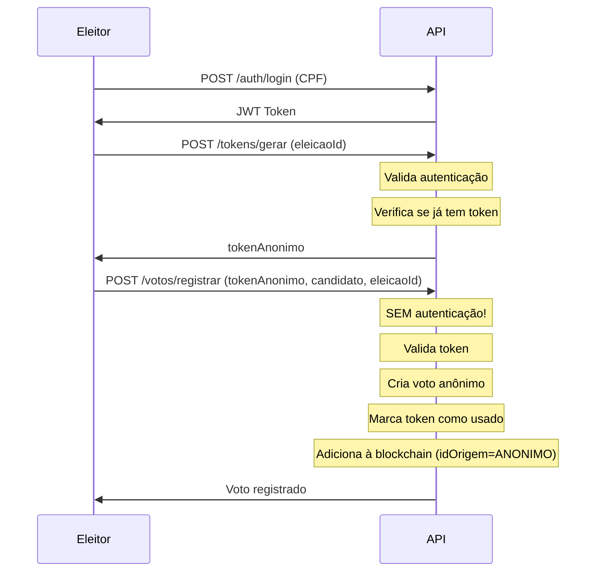

# Fluxo de Votação Segura

Este documento descreve o fluxo completo do sistema de votação anônima implementado no VoxChain.

## 1. Autenticação

**Endpoint**: `POST /api/v1/auth/login`

O eleitor faz login com CPF e senha através do endpoint de autenticação.

**Request:**
```json
{
  "cpf": "12345678900"
}
```

**Response:**
```json
{
  "tipo": "ELEITOR",
  "nome": "Fulano de tal",
  "token": "eyJhbGciOiJIUzI1NiIsInR5cCI6IkpXVCJ9..."
}
```

O token JWT retornado será usado para autenticar requisições subsequentes.

**Segurança:**
- Rate limiting: máximo de 5 tentativas por IP a cada 5 minutos
- Senhas armazenadas com BCrypt (salt rounds: 12)

---

## 2. Solicitação de Token

**Endpoint**: `POST /api/v1/tokens/gerar`

Após autenticação, o eleitor solicita um token anônimo para votação.

**Headers:**
```
Authorization: Bearer <jwt-token>
```

**Request:**
```json
{
  "eleicaoId": "uuid-da-eleicao"
}
```

**Response:**
```json
{
  "tokenAnonimo": "550e8400-e29b-41d4-a716-446655440000",
  "validoAte": 1704124800000,
  "eleicaoId": "uuid-da-eleicao"
}
```

**Características do Token:**
- UUID único e anônimo
- Válido por 30 minutos
- Gerado uma única vez por eleitor por eleição
- Se o eleitor já possui token ativo, retorna erro 409 Conflict

**Validações:**
- Requer autenticação de eleitor (não admin)
- Verifica se eleitor já possui token ativo
- Se já votou, não pode gerar novo token

---

## 3. Votação

**Endpoint**: `POST /api/v1/votos/registrar`

**⚠️ IMPORTANTE**: Esta rota **NÃO requer autenticação**. O voto é completamente anônimo e usa apenas o token.

**Request:**
```json
{
  "tokenVotacao": "550e8400-e29b-41d4-a716-446655440000",
  "numeroCandidato": "13",
  "eleicaoId": "uuid-da-eleicao"
}
```

**Response:**
```json
{
  "mensagem": "Voto registrado com sucesso"
}
```

**Validações realizadas:**
1. Token é válido, não está usado e não expirou
2. Eleição existe e está aberta
3. Verificação temporal:
   - Eleição não iniciou ainda
   - Eleição já encerrou
   - Eleição está ativa
4. Candidato existe na eleição

**Processo interno:**
1. Token é validado
2. Voto é criado (SEM vínculo com eleitor)
3. Token é marcado como usado (não pode ser reutilizado)
4. Transação é criada com `idOrigem = "ANONIMO"`
5. Voto é adicionado ao pool da blockchain

**Segurança:**
- Token usado uma única vez
- Não é possível rastrear voto individual até eleitor
- Voto registrado na blockchain sem identificação do eleitor

---

## 4. Registro na Blockchain

### Estrutura do Voto

O voto na blockchain contém:
- `tokenVotacao`: UUID anônimo (não revela eleitor)
- `idCandidato`: Número do candidato votado
- `tipoCandidato`: Cargo do candidato
- `idEleicao`: ID da eleição
- `timestamp`: Momento do voto

**O voto NÃO contém:**
- ❌ `idEleitorHash`
- ❌ Qualquer identificação do eleitor

### Transação

A transação na blockchain tem:
- `tipo`: VOTO
- `idOrigem`: "ANONIMO" (sempre para votos)
- `payload`: JSON do voto (sem identificação de eleitor)

---

## 5. Registro de Comparecimento

Separadamente do voto, é mantido um `RegistroComparecimento` que indica:
- `eleitorHash`: Hash do CPF do eleitor (para verificar quem votou)
- `eleicaoId`: ID da eleição
- `timestamp`: Momento do comparecimento
- `tokenGerado`: Referência ao token (sem revelar o voto)

**Importante:** Este registro só indica que o eleitor compareceu, mas não revela em quem votou.

---

## 6. Auditoria

Qualquer pessoa pode verificar:
- ✅ Total de votos por candidato
- ✅ Total de votos na eleição
- ✅ Resultado agregado da eleição
- ✅ Integridade da blockchain
- ✅ Validação de duplicatas

**NÃO é possível verificar:**
- ❌ Quem votou em quem
- ❌ Votos individuais vinculados a eleitores
- ❌ Lista de eleitores que votaram
- ❌ Buscar voto de um eleitor específico

---

## 7. APIs Disponíveis

### Públicas (sem autenticação)
- `POST /api/v1/votos/registrar` - Registrar voto (usa apenas token)

### Autenticadas (requer JWT de eleitor)
- `POST /api/v1/tokens/gerar` - Gerar token de votação

### Administrativas (requer JWT de admin)
- `POST /api/v1/eleicoes/criar` - Criar eleição
- `POST /api/v1/candidatos/criar` - Cadastrar candidato
- `POST /api/v1/eleitores/criar` - Cadastrar eleitor
- `GET /api/v1/votos/listar` - Listar candidatos (não votos individuais)

---

## 8. Fluxo Completo - Exemplo



---

## 9. Segurança Implementada

### Anonimato
- ✅ Votos não contêm identificação do eleitor
- ✅ Transações de voto têm `idOrigem = "ANONIMO"`
- ✅ Tokens são UUIDs aleatórios sem vínculo direto
- ✅ Registro de comparecimento separado do voto

### Integridade
- ✅ Tokens válidos por 30 minutos
- ✅ Tokens usados uma única vez
- ✅ Validação temporal de eleições
- ✅ Verificação de candidatos válidos
- ✅ Blockchain imutável

### Prevenção de Fraude
- ✅ Rate limiting no login (5 tentativas / 5min)
- ✅ Senhas com BCrypt
- ✅ Um token por eleitor por eleição
- ✅ Tokens expiram automaticamente
- ✅ Validação de eleição ativa

### Auditoria
- ✅ Logs de ações administrativas
- ✅ Registro de comparecimento
- ✅ Verificação de integridade da blockchain
- ✅ Contagem agregada de votos

---

## 10. Testes Necessários

Após implementação, validar:

1. ✅ Token gerado não pode ser reutilizado
2. ✅ Voto na blockchain não contém idEleitorHash
3. ✅ Não é possível consultar voto individual
4. ✅ Rate limiting funciona após 5 tentativas
5. ✅ Eleitor não pode votar duas vezes
6. ✅ Token expira após 30 minutos
7. ✅ Voto sem autenticação funciona
8. ✅ Token inválido/expirado rejeitado

---

## 11. Diagrama de Dados

```
┌─────────────────┐
│   TokenVotacao  │
├─────────────────┤
│ tokenAnonimo    │ → UUID aleatório
│ eleicaoId       │
│ validoAte       │ → 30min
│ usado           │ → false/true
│ hashAutorizacao │ → SHA-256(eleitorHash+eleicaoId+salt)
└─────────────────┘
        │
        │ usado para
        ↓
┌─────────────────┐
│      Voto       │
├─────────────────┤
│ tokenVotacao    │ → UUID (sem vínculo com eleitor)
│ idCandidato     │
│ tipoCandidato   │
│ idEleicao       │
│ timestamp       │
└─────────────────┘
        │
        │ registrado em
        ↓
┌─────────────────┐
│   Transacao     │
├─────────────────┤
│ tipo: VOTO      │
│ idOrigem:       │ → "ANONIMO"
│ payload: Voto   │ → JSON do voto
└─────────────────┘

┌──────────────────────┐
│RegistroComparecimento│
├──────────────────────┤
│ eleitorHash          │ → Quem votou
│ eleicaoId            │
│ tokenGerado          │ → Token usado (sem revelar voto)
│ timestamp            │
└──────────────────────┘
```

---

## 12. Conclusão

O sistema garante:
- **Anonimato total**: Votos não podem ser rastreados até eleitores
- **Integridade**: Blockchain imutável e verificável
- **Segurança**: Múltiplas camadas de proteção
- **Transparência**: Resultados agregados verificáveis por todos

